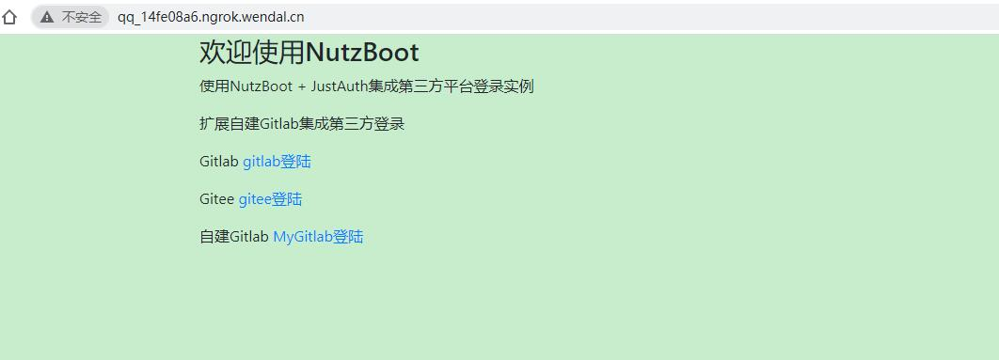
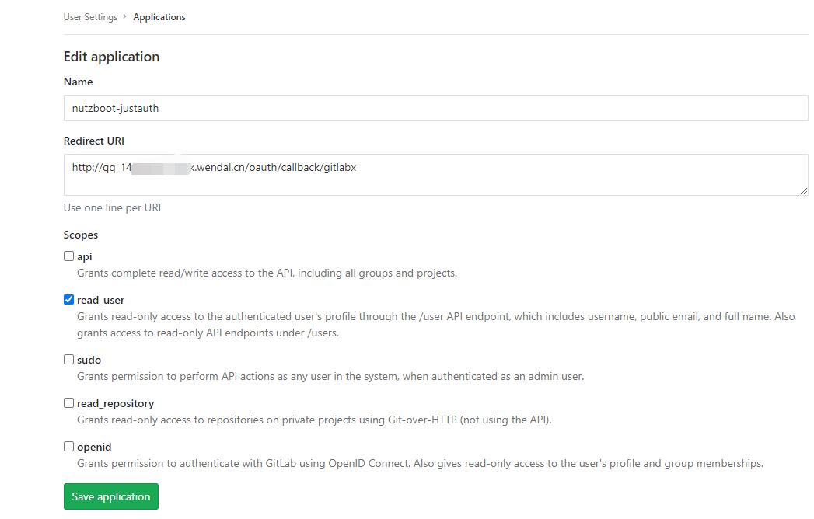
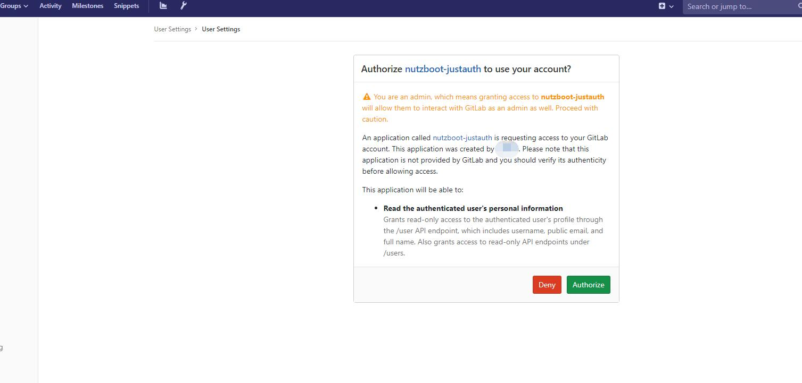
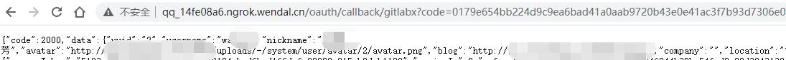
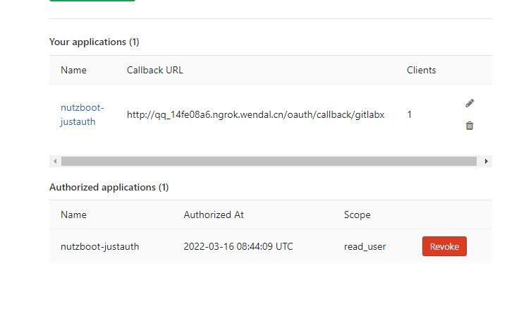

## NutzBoot 集成 JustAuth第三方登录的实例

### 简介

本项目是一个通过NutzBoot集成JustAuth第三方登录实例,可能是一个重复的轮子

eclipse/idea均可按maven项目导入

MainLauncher是入口,启动即可

### 环境要求

* 必须JDK8+
* Maven 3.5
* eclipse或idea等IDE开发工具,可选

### 配置文件

数据库配置信息,jetty端口等配置信息,均位于src/main/resources/application.properties

第三方登录配置
```
#gitlab
gitlab.clientId=08363e0ed************************1a5185ef3ef36bb
gitlab.clientSecret=5b9f9bf************************f2f7a436fe32d7fe6ca14
gitlab.redirectUri=http://qq_14fe****.ngrok.wendal.cn/oauth/callback/gitlab

#gitee
gitee.clientId=bea4e99be4d************************c0814ebcb0d9646d755
gitee.clientSecret=f8efd3f************************2b4afa32ae276daf7a2
gitee.redirectUri=http://qq_14fe****.ngrok.wendal.cn/oauth/callback/gitee

#自建 gitlabx 应用配置
gitlabx.clientId=25531865c98************************b75100f200fe545629
gitlabx.clientSecret=5067c8a4a************************3b2e31efc35e3e3cb4d3a39a3d
gitlabx.redirectUri=http://qq_14fe****.ngrok.wendal.cn/oauth/callback/gitlabx
```
### 扩展

扩展的内容在ext包下，包括request处理类和枚举类

枚举类中地址要换成自建gitlab服务的地址
```java
com.fzclub.justauth.ext.unum.MyAuthSource
GITLABX {
        @Override
        public String authorize() {
            return "http://git.xxxx.com/oauth/authorize";
        }
        @Override
        public String accessToken() {
            return "http://git.xxxx.com/oauth/token";
        }
        @Override
        public String userInfo() {
            return "http://git.xxxx.com/api/v4/user";
        }
        @Override
        public Class<? extends AuthDefaultRequest> getTargetClass() {
            return MyAuthGitlabRequest.class;
        }
    };
```

### 命令下启动

仅供测试用,使用mvn命令即可

```
// for windows
set MAVEN_OPTS="-Dfile.encoding=UTF-8"
mvn compile nutzboot:run

// for *uix
export MAVEN_OPTS="-Dfile.encoding=UTF-8"
mvn compile nutzboot:run
```

### 项目打包

```
mvn clean package nutzboot:shade
```

请注意,当前需要package + nutzboot:shade, 单独执行package或者nutzboot:shade是不行的


### 跳过测试
```
mvn clean package nutzboot:shade -Dmaven.test.skip=true
```

### 访问地址
访问地址：http://qq_14fe08a6.ngrok.wendal.cn



#### 自建Gitlab
其他类型的在以前的demo都有，下面截图是自己搭的gitlab服务
- 创建应用
  
- 授权确认
  
- 回调成功
  
- 已授权客户端, 已经有1个客户端连上了
  

### 部分日志
```java
[DEBUG] 17:00:28.132 org.nutz.mvc.impl.UrlMappingImpl.get(UrlMappingImpl.java:103) - Found mapping for [GET] path=/ : MainLauncher.index(MainLauncher.java:14)
[DEBUG] 17:00:28.132 org.nutz.ioc.impl.NutIoc.get(NutIoc.java:166) - Get 'mainLauncher'<class com.fzclub.justauth.MainLauncher>
[DEBUG] 17:00:28.135 org.nutz.mvc.impl.UrlMappingImpl.get(UrlMappingImpl.java:112) - Search mapping for [GET] path=/index : NOT Action match
[DEBUG] 17:00:28.357 org.nutz.mvc.impl.UrlMappingImpl.get(UrlMappingImpl.java:112) - Search mapping for [GET] path=/user/query : NOT Action match
[DEBUG] 17:00:30.467 org.nutz.mvc.impl.UrlMappingImpl.get(UrlMappingImpl.java:103) - Found mapping for [GET] path=/oauth/login/gitlabx : OauthMudule.login(OauthMudule.java:37)
[DEBUG] 17:00:30.467 org.nutz.ioc.impl.NutIoc.get(NutIoc.java:166) - Get 'oauthMudule'<class com.fzclub.justauth.module.OauthMudule>
[DEBUG] 17:00:30.467 org.nutz.ioc.impl.NutIoc.get(NutIoc.java:192) - 	 >> Load definition name=oauthMudule
[DEBUG] 17:00:30.467 org.nutz.ioc.loader.combo.ComboIocLoader.printFoundIocBean(ComboIocLoader.java:226) - Found IocObject(oauthMudule) in AnnotationIocLoader(packages=[com.fzclub.justauth])
[DEBUG] 17:00:30.467 org.nutz.ioc.impl.NutIoc.get(NutIoc.java:223) - 	 >> Make...'oauthMudule'<class com.fzclub.justauth.module.OauthMudule>
[DEBUG] 17:00:30.468 org.nutz.ioc.impl.ScopeContext.save(ScopeContext.java:65) - Save object 'oauthMudule' to [app] 
[DEBUG] 17:00:30.468 org.nutz.ioc.aop.impl.DefaultMirrorFactory.getMirror(DefaultMirrorFactory.java:76) - Load class com.fzclub.justauth.module.OauthMudule without AOP
[DEBUG] 17:00:30.470 org.nutz.ioc.impl.NutIoc.get(NutIoc.java:166) - Get 'conf'<class org.nutz.ioc.impl.PropertiesProxy>
[DEBUG] 17:00:44.104 org.nutz.mvc.impl.UrlMappingImpl.get(UrlMappingImpl.java:103) - Found mapping for [GET] path=/oauth/callback/gitlabx : OauthMudule.callback(OauthMudule.java:50)
[DEBUG] 17:00:44.104 org.nutz.ioc.impl.NutIoc.get(NutIoc.java:166) - Get 'oauthMudule'<class com.fzclub.justauth.module.OauthMudule>
```
### 相关资源

* 论坛: https://nutz.cn
* 官网: https://nutz.io
* 一键生成NB的项目: https://get.nutz.io
* JustAuth: https://www.justauth.cn
